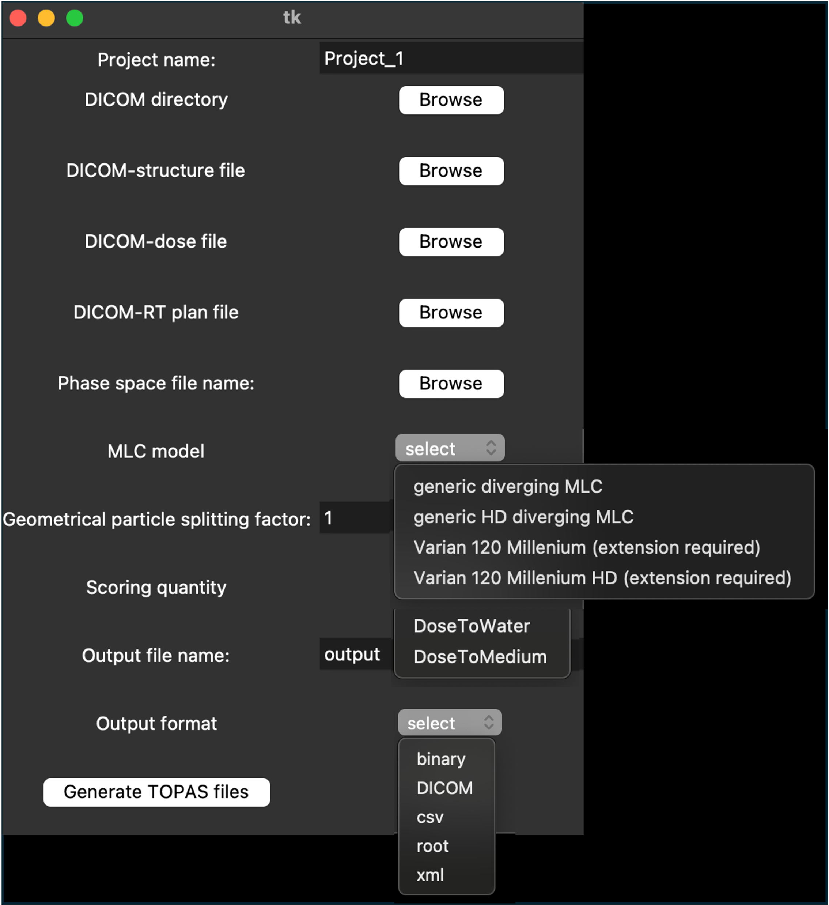

# TPS2TOPAS interface for TrueBeam systems

The Treatment Planning System (TPS) to TOPAS interface (in short, **TPS2TOPAS interface**) is a external tool to TOPAS that allows the automatic conversion of treatment plan specifications to be delivered by the Varian TrueBeam system in photon mode to ready-to-run TOPAS parameter control files (PCF) for Monte Carlo (MC) simulations.

This tool is described in the following publication: [https://doi.org/10.1016/j.ejmp.2024.104485](https://doi.org/10.1016/j.ejmp.2024.104485)

## How to cite
If the tool has been useful for your studies, please acknowledge its use by citing this work:

Ortiz R, Sawkey D, Faddegon B, D-Kondo N, Ramos-Méndez J. An interface tool to parametrize treatment plans for the TrueBeam radiotherapy system into TOPAS parameter control files for Monte Carlo simulation. Physica Medica. 2024;124:104485. doi:10.1016/j.ejmp.2024.104485

# Getting started

## Requirements

#### To use the interface

TPS2TOPAS interface is written in python3. Thus, we recommend to install python (v3.8 or superior) in your system following the offical python instructions at (python.org) for its installation in your operting system, if you have not done it yet.
Alongside with python default libraries, this tool requires:

- pydicom
- numpy
- tkinter (optional, for gui mode, see below)

Please follow the official python instructions to install these libraries.

#### To run the generated PCF in TOPAS.

- TOPAS. To download and install TOPAS, visit the TOPAS collaboration GitHub (https://github.com/OpenTOPAS) and webpage (opentopas.github.io)
> [!WARNING]
> The interface is compatible with OpenTOPAS version 4.0. This version of the TOPAS code is a continuous development from TOPAS version 3.9. The interface is not supported for previous TOPAS versions (3.9 or lower).

- Phase space (PHSP) files from Varian. We recommend to use the PHSP files provided by Varian at (www.myvarian.com) as a source.
> [!WARNING]
> The extension of the phsp files should be changes from *.IAEAphsp* and *.IAEAheader* to *.phsp* and *.header*, respectively.

> [!TIP]
> We recommend to convert the phase space files into TOPAS format. For that, you can use the TOPAS PCF *convertVarianPHSPToTOPAS.txt*.

- The TOPAS geometry extension for the Varian Millenium MLC (optional, for the use of these geometries). This extension is available at (www.myvarian.com). Because of the proprietary nature of the MLC and other details, the extension will be only available after signing the usage agreement on (www.myvarian.com). Otherwise, you can use the generic diverging MLC from TOPAS. 

## How to use

TPS2TOPAS is run from a terminal window.
To print usage instruction in the terminal, type:
```
python3 TPS2TOPAS.py --help 
```
> [!WARNING]
> This documentation assumes that the command to run python in your system is _python3_. It may need to be replaced by the appropriate command from your system if different.

TPS2TOPAS requires user input. Find a list of the information required:
1. Project name
2. path to DICOM directory (DICOM-CT, DICOM-RS, DICOM-RS, and DICOM-RT files should be stored here)
3. path to DICOM-structure file
4. path to DICOM-dose file
5. path to DICOM-RT plan file
6. path to phase space file name
7. MLC model: "generic", genericHD, "Varian" or "VarianHD"
8. Geometrical particle splitting factor (integer number)
9. Scoring quantity: "DoseToWater" or "DoseToMedium
10. Output file name
11. Output file format: "binary", "DICOM", "csv", "root" or "xml"

Generic and GenericHD options in (7) will use the generic TsDivergingMLC TOPAS component with the specifications for the Millenium 120 MLC and Millenium 120 HDMLC, respectively (specifications from literature; see write_PCF.py for details)).
For a complete description of these parameters, please see the publication ([https://doi.org/10.1016/j.ejmp.2024.104485](https://doi.org/10.1016/j.ejmp.2024.104485)).

> [!NOTE]
> TOPAS requires all the DICOM files to be stored in the same directory. This means, your CT data, structures (#3), dose (#4), and plan (#5) files in DICOM format should be stored in the same directory (#2).

> [!TIP]
> DICOM-CT, DICOM-RS, DICOM-RS, and DICOM-RT files can be exported from your TPS.

This information can be input to TPS2TOPAS in two modes: via (1) input parameter file or (2) Graphical User Interface (GUI).

#### Mode 1: input file parameter.
In this mode, an input text file with the user input informations is required. This file should contain 11 rows, each one with the information described above in the same order.

To run this mode, type:
```
 python3 TPS2TOPAS.py -m inputfile TheNameOfYouInputFile.txt
```

> [!WARNING]
> Replace _TheNameOfYouInputFile.txt_ by the name of your input file.

> [!TIP]
> You can see an example of input file, called *inputfile_template.txt*, in the repository.

#### Mode 2: GUI.

To run this mode, type:
```
 python3 TPS2TOPAS.py -m gui
```

A GUI will pop up and you will be able to select the required parameter from _Browse_ buttons, _dropdown menus_, and _text entries_ (see the figure below). To run the script, click on _Generate TOPAS files_.



> [!WARNING]
> This mode requires the installation of the _tkinter_ python library.

> [!NOTE]
> In both modes, if the information is not correct, _ERROR_ messages will appear in the terminal window and the PCF will not be created.

If the required information is correct, PCF files will be created in a directory with the name of the _Project name_ specified. 

> [!NOTE]
> TPS2TOPAS may use default values if some of the information is missing. Please check for _WARNING_ messages in the terminal window.

## ... and to run the PCF in TOPAS
Once the PCF are created you will be able to run them with TOPAS. The PCF to run is called _Main.txt_. Just for visualization, you can run *Main_with_Visualization.txt*, but we strongly DO NOT recommend to run this file for the whole simulation.

For instructions on how to run TOPAS, please see the user guide of OpenTOPAS (opentopas.github.io).

> [!TIP]
> We recommend to run several of the PHSP provided by Varian and combine the results for better statistics. To run the same simulation with different PHSP files, in the _Main.txt" TOPAS file, replace the name of the current path to the PHSP file in the command named s:So/phsp/PhaseSpaceFileName_ by the new PHSP filename.

> [!WARNING]
> The calculation of dose distributions in TOPAS relies on a calibration factor, dependent on the beam energy, that relates the dose per primary history in the simulation to the dose per MU (i.e., calibration factor of the system). This calibration factor may need to be modified if the calibration method employed at your institution is different from the implemented by default in TPS2TOPAS (see [https://doi.org/10.1016/j.ejmp.2024.104485](https://doi.org/10.1016/j.ejmp.2024.104485)) or the phsp files used are different from the recommended ones. Note that the calibration factors included in this version of TPS2TOPAS are for 6MV and 10MV (**not FFF**) beams. 
